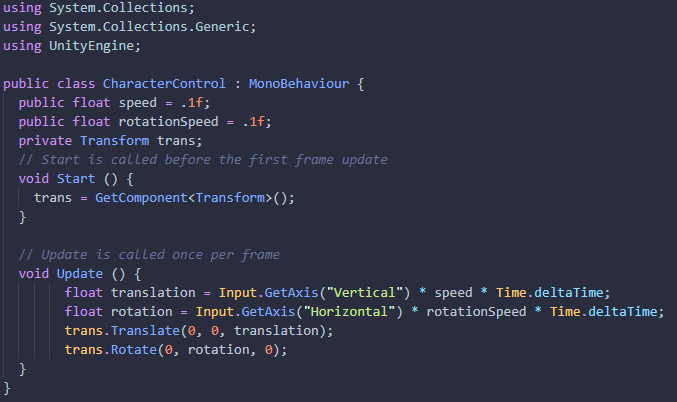
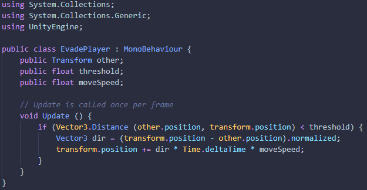

# Práctica 2 - José Nicolás Cabrera Domínguez (alu0101051420)

### Ejercicio 1

El apartado **a** es muy sencillo: como ya hemos visto, introducimos los tres objetos en el menú GameObject > 3D Object seleccionando el que queramos incluir.
La escena, después de colocar y separar los objetos, queda así:

Para añadir físicas a un objeto, necesitaremos incluir en él un componente Rigidbody. Para esto, seleccionamos el objeto y en el inspector, añadimos un nuevo componente.

Esto lo utlizaremos para los apartados **b** y **c**. 
Al aplicarle físicas, vemos que tanto el cubo como la esfera se comportan de la misma forma: el objeto se ve ahora afectado por la gravedad, y cae sobre el plano.

Para el apartado **d**, tendremos que modificar la masa de la esfera. Esto se hace en el inspector, sobre el componente Rigidbody.

En este caso, el resultado no es el que se podría esperar: la esfera cae exactamente a la misma velocidad que el cubo.

Sin embargo, si observamos la interacción entre los objetos, podemos ver que aumentar el peso de la esfera hace que empuje más al cubo al chocar con él. Veamos:

Este es la esfera cayendo con peso = 1 (el cubo también tiene peso = 1)

Ahora, la esfera cayendo con peso = 10 (el cubo sigue teniendo peso = 1)

Para el apartado **e**, tendremos que modificar la componente Box Collider de nuestro objeto Cubo.

Al no tener físicas el cubo, no parece haber cambios en la escena. La bola cae y el cubo no. Sin embargo, en el siguiente apartado se apreciará mejor la influencia de lo que hemos hecho. Como ya hemos visto, aplicamos físicas al cubo añadiéndole una componente Rigidbody. El resultado, como hemos visto en las transparencias del tema, es el siguiente: el cubo cae a la vez que la esfera y atraviesa el plano. Esto es porque un objeto de naturaleza IsTrigger solo utiliza el collider para **detectar** las colisiones; no para restringir el movimiento del propio objeto.

Para el siguiente apartado, tendremos que bloquear la rotación del cubo en ciertos ejes. Esto se consigue modificando la componente Rigidbody, bajo la pestaña de Constraints.

Aquí, haremos tick en las cajas de X y Z del apartado Freeze Rotation. Ahora, si volvemos a probar la colisión entre los objetos, comprobaremos que efectivamente el cubo no puede rotar en los ejes X ni Z. Por esto, parecería que está completamente quieto cuando la esfera lo golpea.

### Ejercicio 2

Para empezar, reescalaremos el plano para poder movernos con libertad, eliminaremos el objeto esfera y recolocaremos el cubo de forma centrada. Esto nos hará las cosas más fáciles. Como en el apartado **a** se nos indica que no debemos aplicar simulación física, no incluiremos en nuestro cubo una componente de Rigidbody. Ahora, podemos pasar a crear un nuevo script.

Este será el script que nos permitirá un control muy básico sobre nuestro cubo. Vemos que, como se nos indica en el apartado **b**, se incluye el valor público para configurar la velocidad del movimiento. Esta velocidad se utiliza más adelante al hacer el translate.

### Ejercicio 3

Para este ejercicio, colocaremos unas esferas en la escena. En mi caso, 4. Las dos de la derecha tienen como tag SphereA y las dos de la izquierda Sphere. Para el primer apartado (cambiar colores y empujar), utilizaremos un script.

Para el segundo apartado, desarrollaremos un script que aplicaremos a los cilindros. Es este:

Como podemos ver, es un script muy sencillo. Funciona calculando la distancia entre el propio objeto y el que nosotros le indiquemos como target. En caso de que la distancia sea menor a la establecida, se calcula la dirección en la que está el objeto target y se mueve en la dirección contraria.

Para crear el nuevo objeto controlado con I, L, J y M, incluiremos unos ejes nuevos para poder utilizar GetAxis(). Así, podremos reutilizar el primer script de control, con muy pocos cambios. 
Para añadir ejes nuevos, lo haremos en Edit > Project Settings. Aquí seleccionaremos Input Manager. Aquí podremos (con clic derecho) duplicar los ejes horizontal y vertical para renombrarlos y asignar teclas nuevas.

Ahora, pasaremos a modificar el script de control del movimiento:

Vemos que ahora, los ejes tanto vertical como horizontal son variables públicas. Ahora, desde el inspector de unity, podremos introducir los ejes a utilizar. (En este caso Horizontal/Horizontal1 y Vertical/Vertical1)

Para el último apartado, colocaremos unos cubos en la escena y pasaremos a crear un nuevo script que aplicarles.
El script será el siguiente:

Y este, el resultado de aplicarlo a los cubos:

